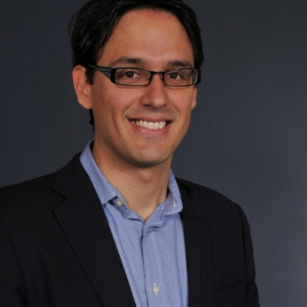

% Dr Marko Aunedi
% Imperial College London, Department of Electrical and Electronic Engineering
% _Advanced Research Fellow_

%type:Imperial

%person

Marko has 20 years of research experience in energy system modelling and optimisation. His key research interests cover:

- Multi-energy vector modelling including electricity, heat and gas
- Benefits of smart grid and energy storage technologies
- System integration of renewable and low-carbon technologies
- Impact of flexible demand on low-carbon energy systems
-
My particular interests lie in building numerical simulation models to evaluate the benefits of technologies such as energy storage or Demand-Side Response (DSR) in supporting cost-efficient decarbonisation of multi-energy systems and the integration of renewable energy.

For over a decade he has been collaborating with the UNFCCC Secretariat by providing expertise in reviewing national communications on climate change.
