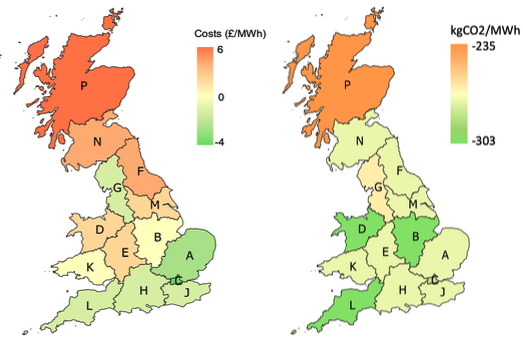
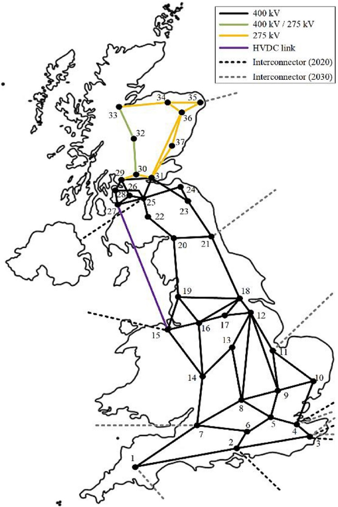

% Models
% DIGEST advances and links leading national network models

# The Edinburgh model

Edinburgh have developed a high-fidelity 3000 node GB transmission network model integrated with a Balancing Mechanism model and Elexon unit-level data.

# The Imperial model (WeSIM)

Imperial use the long established whole-electricity system model (WeSIM), which quantifies cost implications across different segments of electricity system using mixed integer linear programming. As part of this project WeSIM will be extended to represent the GB transmission network with a granularity of 37 nodes.

