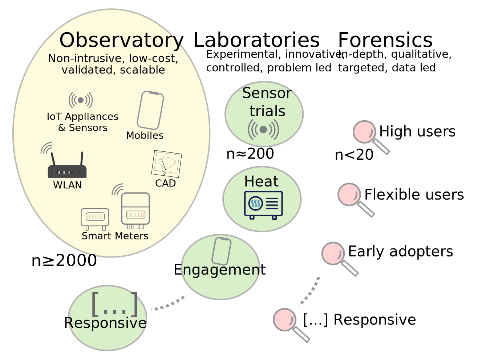

% Structure
% Observatories, Laboratories and Forensic functions

% lab.css

Observatory
===========

The EDOL observatory will consist of approximately 2000 GB households. The instrumentation of these homes is unintrusive and has undergone extensive testing prior to deployment.

Alongside smart meter data, EDOL will access in-home sensors and devices with wireless communication. Surveys will periodically administered and updated. Otherwise, interaction with household members is kept to a minimum, to avoid influencing the observations.

The observatory serves as a control group for EDOL Laboratories and other studies.

Laboratories
============

Laboratories are administered by EDOL directly or in partnership with collaborators. They tend to be 100-200 households in scale.

All laboratories adhere to the same instrumentation and data management standards, such that results can be linked and related to the EDOL Observarory and other Laboratories. The Observatory acts as a control group for Laboratories.

The Laboratories serve four different functions.

**Technology Labs**: specifically targeted at early adopters or pilot studies of new or emerging technologies, such as heat pumps, electric vehicles or smart home solutions.

These labs establish the social and technical impact of such technologies, how they re-shape household practices and demand patterns.

**Engagement Labs** interact with households with information, feedback, support or advice to establish their efficacy.

**Policy Labs** trial policies and their impact on different social groups and user types. They form the basis for evidence led policy design.

**Instrumentation Labs** test sensors and a variety of instruments, including qualitative, ethnographic and game-based approaches, to establish their robustness, validity and cost effectiveness. Passing these tests is a prerequisit to deployment in the Observatory.

Forensics
=========

Detailed forensic assessments are performed for households that deviate in unexpected and unexplained ways from predicted energy use patterns. The sample sizes tens to be smaller (n<20), but allow for more in-depth analysis of the causes of unusual energy use. Tools include in-person interviews, building surveys and ethnographic research.
