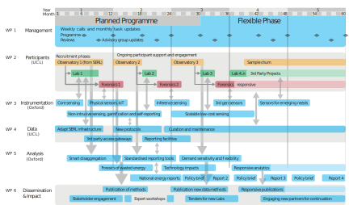

% Work packages
% EDOL has six work packages

1. Management (UCL)
2. Participants (UCL)
3. Instrumentation (Oxford, Engineering)

- 3.1. Sensors (UCL)
- 3.2. Inferences (Oxford, Engineering)
- 3.3. Ethnography (Oxford, Geography)

4. Data (UCL)
5. Analysis (Oxford, Engineering)
6. Dissemination and impact (All)

Work plan
=========

%big

