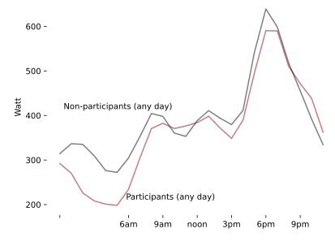
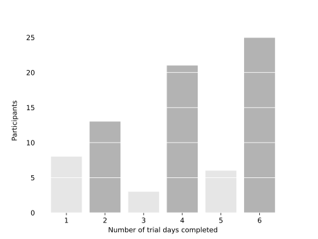
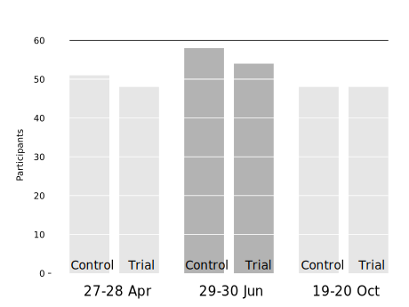

% ReNEW Laboratory Interventions
% Phil Grunewald
% 31 Oct 22

Participants in the ReNEW laboratory have completed their third intervention trial on which they were asked ot keep activity diaries and perform a load reduction between 5pm and 7pm.

