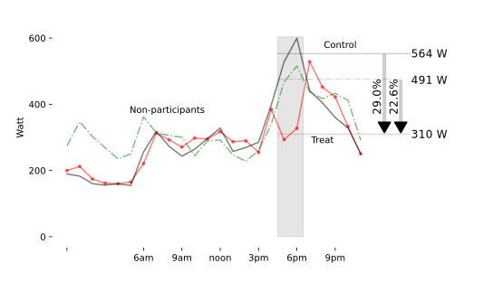
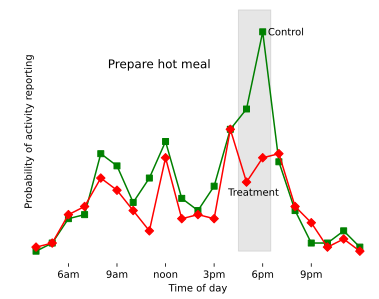
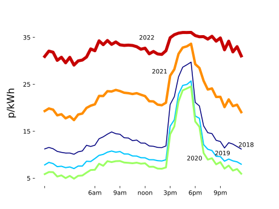

% Paying people to reduce peak demand - does it work?
% Phil Grunewald
% 18 November 2022

With the prospect of blackouts looming this winter, the UK's grid operator plans to offer [discounts on electricity bills](https://www.bbc.co.uk/news/business-63483668) for people who can cut their energy consumption at peak times (usually between 4 and 7pm). For every kilowatt-hour (kWh) avoided on critical days, households can save £3.

It's hoped that these price signals will lower the strain on energy supply and prevent power cuts. But households are not receiving information about how to lower their demand effectively. So what can people do in these situations – and are they likely to take these steps if asked?

Luckily, the University of Oxford has been trialling such situations by asking UK households to reduce their electricity use between 5pm and 7pm and observing their response. Load profiles as well as surveys and activity diaries are collected to understand how people manage with such requests. Some important lessons from this research can help us through the winter.

## Households can slash energy use quickly

Approximately a third of households [within the study] take up the email invitation each time. They get a few days notice and need to reduce their electricity use by at least 10% over the two hour period.
Of these, around two thirds successfully reduced their demand when asked. 

Their average demand reduced by 29% when compared to their own past demand. It tends to be people with slightly higher demand who do best at reducing it.

## Most people don't know best ways to save energy

Despite this significant reduction, when we ask participants about the things they did to reduce electricity use, many of them are well-intentioned, but ineffective.

For instance, the effect on overall energy demand of unplugging a mobile phone charger is negligible.

When asking focus groups how much mobile phones contributed to overall electricity consumption, the typical responses are between 1% and 5%. It is actually less than 0.1%. A similar misconception exists around kettles. Turning the kettle on, drives the in-home-display into the red, because they use a lot of power. But they are only on for a matter of minutes and therefore don't make a big difference to overall energy use. 

## Hot meals matter

More effective than avoiding phone chargers and kettles is turning off washing machines and dishwashers. The most effective way to help avert a blackout in an energy supply pinch is to avoid preparing a hot meal. [Hot meals](https://www.sciencedirect.com/science/article/pii/S0306261919319336\). Research suggests that hot meal preparation is one of the most common activities that lead to high energy demand during the peak hours. Study participants who reduced their energy use the most, tend to avoid the oven and other cooking appliances. (See also Amil Al-Habaibeh’s suggestions to save energy by switching to efficient appliances, such as air-fryers and microwaves [https://theconversation.com/air-fryers-and-pressure-cookers-how-you-can-save-money-on-your-cooking-bills-192303])

## Money is not the only motivation

Tariffs which charge a higher rate at peak times (known as time of use tariffs) can reduce peak energy demand by [between 2% and 8%](https://www.sciencedirect.com/science/article/abs/pii/S2214629618300744). These price signals encourage people to avoid activities which consume a lot of energy, such as cooking food in an oven, during peak hours. Unfortunately, the strength of this signal has been somewhat lost among continuously high prices in recent months.

It's important to note that not every household has the same capacity to reduce or shift their energy demand. The top 10% of electricity users consume ten times as much as the bottom 10%. Households in this lower quartile are increasingly fuel-poor and have limited ability to reduce their demand further.

The money people save when avoiding energy use for short periods of time tend to be [modest](https://www.sciencedirect.com/science/article/abs/pii/S2214629621003820). Even households that reduced their demand by 29% over two hours only saved about half a kWh, or £1.50 from the system operator's special incentive scheme. Some households may decide that for £1.50, they’d rather have a hot dinner.

In fact, increases in energy prices over the past two years have so far led to very little, if any, reduction in demand. The messaging around the price cap may have been [misleading](https://theconversation.com/why-the-energy-price-cap-is-confusing-and-how-it-could-be-better-communicated-192112). Bills are not 'capped' at £2500 pounds and using more energy remains will result in higher bills. The best way to save money on energy bills is to use less.

But many lack the resources to meet their energy service needs with less energy. Not everyone can afford the latest, most efficient appliances, or to refurbish their home.

In case of a genuine national emergency, the responses of households when asked to reduce demand in the short term are encouraging.
But reducing peak demand is valuable even when we are not facing an acute emergency or blackout. Energy use during peak hours tends to be more expensive and polluting, because it relies on some gas and in some cases even diesel power.

Any information to help people adopt practices that avoid high energy use during peak hours will make the energy system cleaner, cheaper and more reliable for all. This applies especially to they way we heat our homes. A large-scale investment to upgrade the UK housing stock, making it more energy efficient and replacing gas boilers with electric heat pumps is [a no-regret solution](https://theconversation.com/four-energy-saving-lessons-from-the-first-lockdown-which-may-help-us-through-the-winter-148823), saving on household bills and emissions in the long run.

## The public needs better information

What sources of information and feedback are available to energy users today? Not a lot. Energy bills are too infrequent, non-specific and distorted to provide meaningful feedback on the causes of high bills and effective measures to reduce them 

They do not even convey the summer-winter variation, which would highlight the significance of heating in winter, by spreading the billing amount over years. Then there is the in-home-display that come with smart meters, but as the example with the kettle has shown, these do not necessarily translate information into the right message either.

While data from electricity smart meters offer personalised and targeted feedback on energy use, very little of it is used. Smart meter data sits with suppliers for billing purposes (and to remotely disconnect anyone who doesn’t pay). Privacy rules and regulations mean that it is barely accessible to the householders themselves, let alone a third party service provider who could help them to make sense of it.

Much more can be made of these data. University College London and the University of Oxford are setting up a national observatory for household energy demand, which will improve understanding of energy demand, how it changes over time and what interventions and technology changes can help in delivering a sustainable, affordable and secure energy system. 

This evidence can produce information campaigns which help households make educated decisions. Are my appliances delivering value for money? When should I switch my gas boiler for a heat pump? What size of heat pump is right for me and what efficiency measures for the home should come first?

Turning the new wealth of new smart meter data into information, and ultimately synthesizing this information into user-friendly messages and personalised tips could transform the effectiveness of demand side measures.
