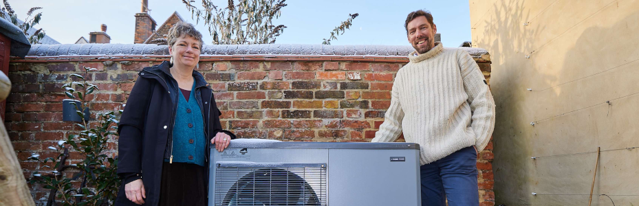

% New, £8 million Energy Demand Observatory and Laboratory will help UK meet net-zero ambitions
% Press release
% 11 January 2023

-   University College London and the University of Oxford will jointly
    lead a five-year project to collect high-resolution data (with
    informed consent of participants) on energy usage in UK homes.

-   'Field laboratories' will enable specific policies and interventions
    to reduce carbon emissions from homes to be tested in real-world
    conditions.

-   Findings from the project will help inform strategies to enable the
    UK to reach net-zero carbon emissions by 2050.

University College London (UCL) and the University of Oxford will lead
an £8.7m research project to establish an Energy Demand Observatory and
Laboratory (EDOL) in the UK. The five-year programme, funded by the
Engineering and Physical Sciences Research Council (EPSRC, part of UK
Research and Innovation) and working with the Department for Business,
Energy and Industrial Strategy (BEIS), will establish a national energy
data platform to help facilitate the transition to net-zero carbon
emissions.

Energy use in homes is responsible for almost a fifth of UK carbon
emissions, and the biggest driver of increased energy demands during the
peak winter period. If the UK is to reach net-zero emissions by 2050,
domestic energy will have to stop using natural gas and transition to a
low-carbon system. However, there is currently little information on how
this will impact patterns of energy usage, and whether this will overlap
with other changes to the UK's energy system, including the increased
uptake of electric cars and heat pumps.

EDOL will address this by providing a high-resolution data resource that
will track energy use in real households (with informed consent of
participants), enabling us to understand how, why, and when domestic
activity is impacting energy demand and associated carbon emissions.

EDOL will develop a range of innovative methods -- including innovations
emerging around AI and the Internet of Things (IoT) - for monitoring not
only the energy consumed by different appliances, but also the different
energy-using activities that make up daily life at home.

EDOL will consist of three elements:

1.  An 'Observatory' of 2000 representative UK households equipped with
    sensors to record the energy used by occupants, their appliances,
    and their behaviours. The anonymised data will then be analysed by
    researchers to better understand patterns of energy demand in our
    homes.

2.  'Forensic' analyses of sub-samples of homes that have novel or
    lesser-known forms of energy demand (for instance, smart charging of
    electric vehicles). This could include detailed surveys, interviews,
    and in-depth monitoring.

3.  'Field laboratories' of 100-200 households in which policies,
    technologies, business models, and other interventions can be tried
    out and compared to relevant control groups in the Observatory. This
    will allow the researchers to answer novel questions, such as: \'How
    flexible is the time when people choose to charge their electric
    vehicles?\', or \'Does installing a heat pump have unintended
    consequences such as increased tumble drying of clothes due to lower
    radiator temperatures?\'

UCL Energy Institute will be leading on data collection, analysis, and
governance, as well as overall management of the project. UCL will build
on relevant experience developed via the Smart Energy Research Lab
([SERL](https://serl.ac.uk/)) project, bringing specific expertise
regarding innovative techniques for analysing smart meter data.

[Professor Tadj Oreszczyn]($About/People/5_Tadj.html) (UCL Energy Institute), Principal Investigator
for the project, said: 'In order to tackle the serious challenges facing
our society such as fuel poverty, the energy cost crisis and climate
change, we need accurate real-world energy consumption data combined
with additional data-streams from, for example, sensors and smart home
devices, to facilitate innovative research. EDOL is a major step forward
in enabling research for public benefit using cutting edge technology
and research techniques.'

The University of Oxford will lead on instrumentation and analysis, and
qualitative research, overseen by Dr Philip Grünewald (Department of
Engineering Science, University of Oxford) and Dr Tina Fawcett (School
of Geography and the Environment, University of Oxford).

Dr Grünewald said: 'EDOL will raise evidence-based policy making to a
new level, by providing a scientifically rigorous demand observatory.
This collaboration will be unique in providing a detailed, longitudinal
resource of UK domestic energy use which will be available to
scientists, industry, and policy-makers. The research will be dynamic,
able to respond to a fast-moving technological and policy landscape, and
will enable us to propose cost-effective smart data solutions and
innovation in real-time and at scale.'

[Dr Tina Fawcett](https://www.eci.ox.ac.uk/people/tfawcett.html)
(Environmental Change Institute), who will lead the social research
aspect of the project, added: 'EDOL is a really important, long-term
investment in energy demand research, which will enable us to understand
current and future household energy use as never before. The experiments
with EDOL households will allow us to explore who benefits or loses from
different social, technical, and economic energy interventions. This
will help provide the evidence we need to create a just energy
transition.'

EPSRC Director for Cross-Council Programmes, Dr Kedar Pandya, said:
'Accurate, high-resolution data will be crucial to understanding energy
usage across UK households and informing new forms of energy usage. With
support from Government, the Energy Demand Observatory and Laboratory
will build on the work of the Smart Energy Research Lab to address this
need. It will offer unprecedented scale in providing this data, which
will support the decisions needed to help us to reduce carbon emissions
and make the switch to Net Zero.'

**Notes to editors:**

For media enquiries, contact Dr Caroline Wood, University of Oxford:
caroline.wood@admin.ox.ac.uk

**About UCL -- London's Global University**

UCL is a diverse global community of world-class academics, students,
industry links, external partners, and alumni. Our powerful collective
of individuals and institutions work together to explore new
possibilities.

Since 1826, we have championed independent thought by attracting and
nurturing the world\'s best minds. Our community of more than 43,800
students from 150 countries and over 14,300 staff pursues academic
excellence, breaks boundaries and makes a positive impact on real world
problems.

We are consistently ranked among the top 10 universities in the world
and are one of only a handful of institutions rated as having the
strongest academic reputation and the broadest research impact.

We have a progressive and integrated approach to our teaching and
research -- championing innovation, creativity and cross-disciplinary
working. We teach our students how to think, not what to think, and see
them as partners, collaborators and contributors.

For almost 200 years, we are proud to have opened higher education to
students from a wide range of backgrounds and to change the way we
create and share knowledge.

We were the first in England to welcome women to university education
and that courageous attitude and disruptive spirit is still alive today.
We are UCL.

www.ucl.ac.uk \| Follow \@uclnews on Twitter \| Read news at
www.ucl.ac.uk/news/ \| Listen to UCL podcasts on SoundCloud \| Find out
what's on at UCL Minds

The [Smart Energy Research Lab (SERL)](http://www.serl.ac.uk) is an
EPSRC funded research resource that provides a secure, consistent and
trusted channel for researchers to access high-resolution energy data.

**About the University of Oxford**

Oxford University has been placed number 1 in the Times Higher Education
World University Rankings for the seventh year running, and ​number 2 in
the QS World Rankings 2022. At the heart of this success are the
twin-pillars of our ground-breaking research and innovation and our
distinctive educational offer.

Oxford is world-famous for research and teaching excellence and home to
some of the most talented people from across the globe. Our work helps
the lives of millions, solving real-world problems through a huge
network of partnerships and collaborations. The breadth and
interdisciplinary nature of our research alongside our personalised
approach to teaching sparks imaginative and inventive insights and
solutions.

Through its research commercialisation arm, Oxford University
Innovation, Oxford is the highest university patent filer in the UK and
is ranked first in the UK for university spinouts, having created more
than 200 new companies since 1988. Over a third of these companies have
been created in the past three years. The university is a catalyst for
prosperity in Oxfordshire and the United Kingdom, contributing [£15.7
billion to the UK
economy](https://www.ox.ac.uk/about/facts-and-figures/economic-impact) in
2018/19, and supports more than 28,000 full time jobs.

**About the Engineering and Physical Sciences Research Council (EPSRC)**

The Engineering and Physical Sciences Research Council (EPSRC) is the
main funding body for engineering and physical sciences research in the
UK. Our portfolio covers a vast range of fields from digital
technologies to clean energy, manufacturing to mathematics, advanced
materials to chemistry.

EPSRC invests in world-leading research and skills, advancing knowledge
and delivering a sustainable, resilient and prosperous UK. We support
new ideas and transformative technologies which are the foundations of
innovation, improving our economy, environment and society. Working in
partnership and co-investing with industry, we deliver against national
and global priorities.
