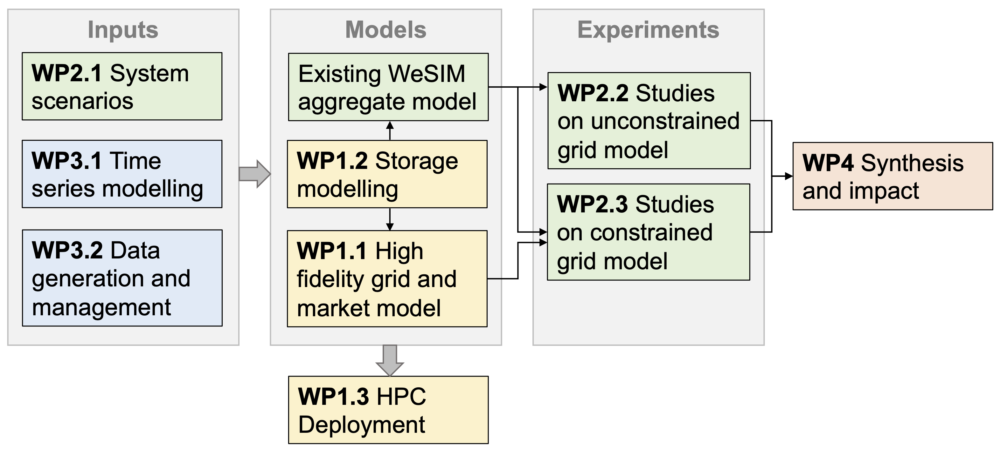

% Objectives
% DIGEST has five key objectives

1. Develop a high-fidelity GB transmission system power flow and market model which can be used to evaluate the direct and indirect carbon impacts of new grid-scale energy storage systems, accounting for technology and location.
2. Develop scenarios for assessing the carbon reduction potential of energy storage at investment/planning time scales and methods for quantifying the impact of energy storage investment decisions on system-level carbon and financial performance.
3. Develop new tools for time series modelling and data curation, generation, and management to improve model consistency and to accurately quantify the uncertainty of results.
4. Complete national scale analysis for the next 15 years and develop a report with policy recommendations for near- and longer-term market reforms.
5. Integrate the new models into an open-source software toolkit for other researchers, analysts, and policymakers.
